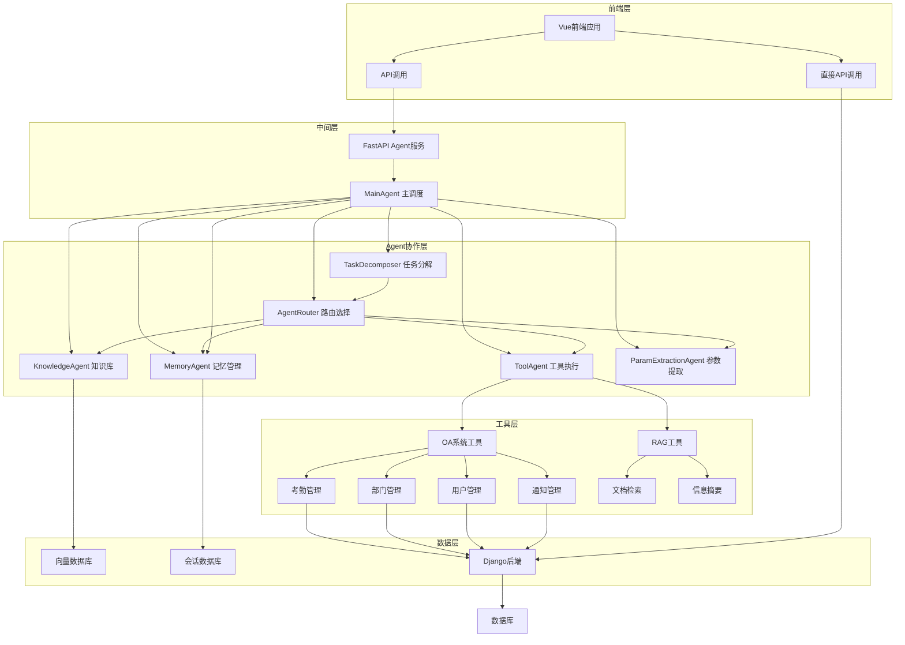
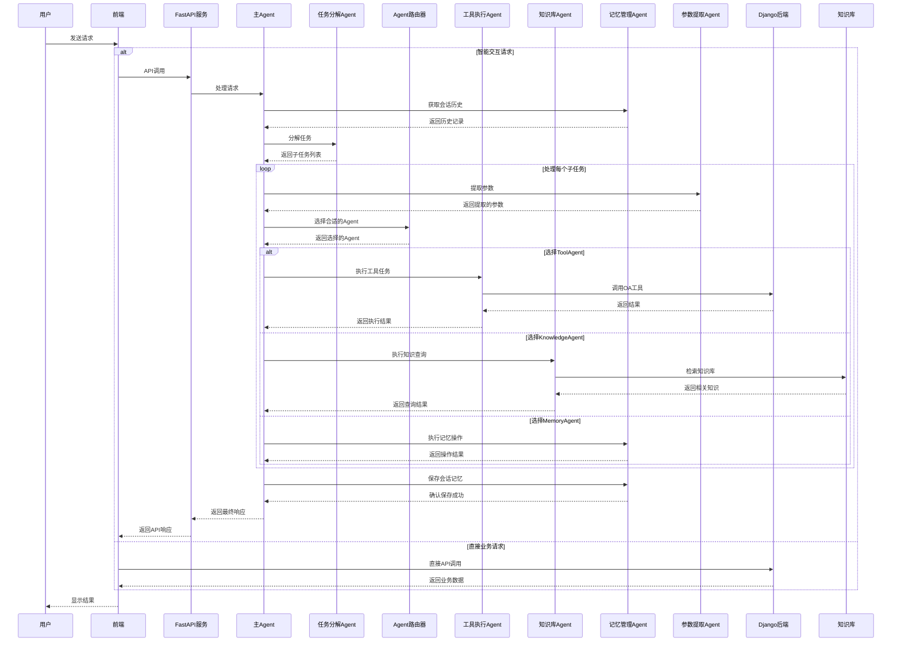

# 智能办公自动化系统 (AI-Powered OA System)

一个前后端分离的智能办公自动化系统，深度集成AI能力，提供智能化的办公体验。系统采用Django + Vue 3构建前后端核心功能，通过独立的FastAPI微服务提供AI Agent、RAG知识库等智能服务。

## 项目概述

本系统旨在为企业提供高效的办公自动化解决方案，同时融入人工智能技术，实现智能问答、知识库问答、自动化任务处理等AI增强功能。系统采用微服务架构，将传统OA功能与AI能力解耦，确保各部分独立开发、部署和扩展。

整体架构分为三个主要部分：Django后端提供核心业务API和数据持久化，Vue 3前端提供现代化用户界面，FastAPI微服务提供AI智能体能力。这种架构设计既保证了OA系统本身的稳定性和专业性，又为系统赋予了智能化升级的能力。

## 整体架构



### 多Agent协作流程



### Agent职责说明

1. **MainAgent**：主调度Agent，负责协调各个子Agent的工作流程，是整个系统的核心。

2. **TaskDecomposer**：任务分解Agent，将复杂任务分解为可执行的子任务，定义子任务的优先级和依赖关系。

3. **AgentRouter**：Agent路由器，根据任务类型和内容智能选择合适的Agent来执行任务。

4. **ToolAgent**：工具执行Agent，负责调用外部工具执行任务，如OA系统操作、API调用等。

5. **KnowledgeAgent**：知识库Agent，负责查询和检索知识库信息，处理RAG相关任务。

6. **MemoryAgent**：记忆管理Agent，负责管理会话记忆，处理历史记录相关任务。

7. **ParamExtractionAgent**：参数提取Agent，专门从上下文中抽取子任务所需参数。

### 系统特点

1. **模块化设计**：各个Agent职责明确，模块化程度高，便于维护和扩展。

2. **协作机制**：通过MainAgent协调，各个子Agent之间形成有效的协作机制。

3. **灵活路由**：AgentRouter根据任务类型智能选择合适的Agent，提高系统的适应性。

4. **记忆管理**：MemoryAgent负责管理会话记忆，提高系统的上下文理解能力。

5. **参数提取**：ParamExtractionAgent自动从上下文中提取参数，减少用户输入负担。

6. **工具集成**：ToolAgent集成了多种工具，可处理不同类型的任务。

7. **知识检索**：KnowledgeAgent通过RAG技术，可从知识库中获取相关信息。

## 技术栈

### 后端技术栈

后端采用Django作为主要框架，配合Django REST Framework提供标准化的RESTful API。数据库使用MySQL存储业务数据，Redis用于缓存和会话管理，Celery处理异步任务如邮件发送。认证机制采用JWT确保API安全性。

- **框架**：Django 5.2.6 + Django REST Framework
- **数据库**：MySQL
- **缓存**：Redis
- **异步任务**：Celery
- **认证**：JWT (JSON Web Token)
- **跨域**：CORS
- **邮件**：SMTP (QQ邮箱)

### 前端技术栈

前端基于Vue 3生态系统构建，使用Vite作为构建工具实现快速开发。状态管理采用Pinia，UI组件库使用Element Plus，富文本编辑使用WangEditor，图表展示使用ECharts。

- **框架**：Vue 3 + Vue Router 4
- **状态管理**：Pinia
- **UI组件**：Element Plus
- **构建工具**：Vite
- **HTTP客户端**：Axios
- **富文本编辑器**：WangEditor
- **图表库**：ECharts
- **代码规范**：Prettier

### AI服务技术栈

AI服务采用FastAPI构建高性能异步API，基于LangChain和LangGraph实现智能体协作系统。RAG模块使用ChromaDB作为向量数据库，Re-Ranker模型提升检索质量。整体设计遵循工具调用标准化、记忆管理层次化、认证机制安全化的原则。

- **框架**：FastAPI
- **AI框架**：LangChain, LangGraph
- **向量数据库**：ChromaDB
- **记忆存储**：Redis
- **认证**：JWT
- **限流**：自定义中间件
- **日志**：结构化日志系统

## 功能模块

### 1. 用户认证系统 (officeAuth)

用户认证模块提供完整的用户生命周期管理功能。包括用户注册和邮箱激活流程，用户登录登出操作，JWT令牌的颁发和刷新，用户个人信息和密码管理，部门组织架构管理，以及部门领导指定等功能。该模块是整个系统安全的基础，所有其他模块的访问都依赖于认证模块提供的身份验证服务。

### 2. 考勤管理系统 (officeAttendance)

考勤管理模块处理员工的考勤相关业务。员工可以提交请假申请，系统支持多种请假类型如事假、病假、年假等。申请提交后进入审批流程，由相应的审批人进行处理。员工和审批人可以查询各自的考勤记录，了解申请状态和审批历史。该模块与AI服务集成，允许通过自然语言查询考勤信息。

### 3. 员工管理系统 (staff)

员工管理模块提供员工信息的完整CRUD操作，支持批量数据导出功能。异步邮件通知功能允许系统向员工发送入职欢迎、节假日关怀等邮件。模块设计了标准化的接口，能够被AI Agent调用，实现通过自然语言进行员工信息查询和统计。

### 4. 文件管理系统 (file)

文件管理模块处理企业内部的文件存储和分发需求。支持文件上传下载操作，提供文件分类管理功能。文件存储在media目录中，支持各种类型的办公文档管理。

### 5. 通知系统 (inform)

通知系统实现企业内部的信息发布和传递机制。管理员可以发布各类通知，支持按部门设置通知的可见性范围。系统跟踪通知的阅读状态，已读未读一目了然。员工可以查看历史通知，确保重要信息不遗漏。

### 6. 首页功能 (home)

首页模块聚合展示各类关键信息，包括最新的系统通知、最近的考勤申请记录、部门人员统计等。为用户提供便捷的信息入口，快速了解工作动态。

### 7. AI智能助手 (FastAPIAgentService)

AI智能助手是本次重构新增的核心功能，通过独立的微服务形式与OA系统集成。系统采用多智能体协作架构，不同的智能体承担不同的职责：主智能体负责意图理解和对话管理，任务分解智能体将复杂请求拆分为可执行的子任务，参数提取智能体从用户话语中解析所需参数，工具调用智能体执行具体的API操作，知识库智能体提供RAG增强的问答能力，记忆智能体管理对话历史和上下文。

RAG知识库服务支持企业知识文档的向量化存储和语义检索，通过Re-Ranker模型优化检索结果排序。工具调用系统标准化了OA业务操作的接口定义，AI Agent能够查询考勤、员工、通知等各类业务数据，甚至完成请假申请提交等操作。记忆管理系统支持多会话隔离，Redis存储确保高速读写。

## 项目结构

### 整体项目结构

```
OAProject/
├── DjangoOfficeProject/      # Django后端项目
├── oa-vue-project/           # Vue前端项目
└── FastAPIAgentService/      # FastAPI AI微服务
```

### 后端项目结构

```
DjangoOfficeProject/
├── DjangoOfficeProject/         # 项目主配置目录
│   ├── __init__.py              # Celery应用初始化
│   ├── asgi.py                  # ASGI配置
│   ├── celery.py                # Celery配置
│   ├── settings.py              # Django配置
│   ├── urls.py                  # 主路由
│   └── wsgi.py                  # WSGI配置
├── apps/                        # 业务应用模块
│   ├── officeAuth/              # 用户认证
│   ├── officeAttendance/        # 考勤管理
│   ├── staff/                   # 员工管理
│   ├── file/                    # 文件管理
│   ├── inform/                  # 通知系统
│   └── home/                    # 首页功能
├── media/                       # 媒体文件
├── templates/                   # HTML模板
├── manage.py                    # Django管理脚本
└── requirements.txt             # 依赖清单
```

### 前端项目结构

```
oa-vue-project/
├── src/
│   ├── api/            # API请求封装
│   ├── assets/         # 静态资源
│   │   ├── css/        # 样式文件
│   │   ├── img/        # 图片资源
│   │   └── js/         # JavaScript文件
│   ├── components/     # 公共组件
│   │   ├── AIChatWindow.vue    # AI聊天窗口
│   │   └── GlobalFloatingBall.vue  # 全局悬浮球
│   ├── router/         # 路由配置
│   ├── stores/         # Pinia状态管理
│   ├── views/          # 页面组件
│   ├── App.vue         # 根组件
│   └── main.js         # 入口文件
├── package.json
└── vite.config.js
```

### AI服务项目结构

```
FastAPIAgentService/
├── app/
│   ├── agent/                 # 智能体实现
│   │   ├── main_agent.py      # 主智能体
│   │   ├── tool_agent.py      # 工具调用智能体
│   │   ├── knowledge_agent.py # 知识库智能体
│   │   ├── task_decomposer.py # 任务分解智能体
│   │   ├── param_extraction_agent.py  # 参数提取智能体
│   │   ├── memory_agent.py    # 记忆管理智能体
│   │   ├── agent_router.py    # 智能体路由
│   │   ├── agent_middleware.py # 智能体中间件
│   │   └── workflow.py        # 工作流定义
│   ├── router/                # API路由
│   │   ├── chat.py           # 对话接口
│   │   ├── health.py         # 健康检查
│   │   └── user.py           # 用户接口
│   ├── rag/                   # RAG实现
│   │   ├── rag_service.py    # RAG服务
│   │   ├── reorder_service.py # 重排序服务
│   │   ├── vector_store.py    # 向量存储
│   │   └── text_spliter.py   # 文本分割
│   ├── tools/                 # 工具定义
│   │   ├── oa_tools.py       # OA业务工具
│   │   └── rag_tools.py      # 知识库工具
│   ├── memory/                # 记忆管理
│   ├── db/                    # 数据库配置
│   │   ├── db_config.py      # 主数据库
│   │   └── redis_config.py   # Redis缓存
│   ├── schemas/               # 数据模型
│   │   ├── oa_schemas.py     # OA相关模型
│   │   └── rag_schemas.py    # RAG相关模型
│   ├── core/                  # 核心功能
│   │   ├── rate_limit.py     # 限流中间件
│   │   ├── logger_handler.py # 日志处理
│   │   ├── success_response.py  # 成功响应
│   │   └── failed_response.py   # 失败响应
│   └── utils/                 # 工具函数
├── data/                      # 数据存储
│   └── chromadb/             # ChromaDB数据
├── main.py                    # 应用入口
└── requirements.txt           # 依赖清单
```

## 环境要求

后端环境需要Python 3.8及以上版本，MySQL 5.7及以上版本，Redis 6.0及以上版本。前端环境需要Node.js 20.19.0及以上或22.12.0及以上版本。AI服务环境需要Python 3.10及以上版本，足够存储向量模型和Reranker模型的磁盘空间，建议16GB及以上内存以支持模型推理。

## 快速开始

### 1. 克隆项目

```bash
git clone https://github.com/RMA-MUN/oa-brain
cd oa-brain
```

### 2. 后端配置与启动

#### 2.1 创建虚拟环境并安装依赖

```bash
cd DjangoOfficeProject
python -m venv venv
venv\Scripts\activate

pip install -r requirements.txt
```

#### 2.2 配置数据库

在`DjangoOfficeProject/settings.py`中配置MySQL连接信息：

```python
DATABASES = {
    'default': {
        'ENGINE': 'django.db.backends.mysql',
        'NAME': 'django_oa',
        'USER': 'root',
        'PASSWORD': 'your_password',
        'HOST': 'localhost',
        'PORT': '3306',
    }
}
```

#### 2.3 配置邮件服务

在settings.py中配置邮件服务，用于用户激活等功能：

```python
EMAIL_BACKEND = 'django.core.mail.backends.smtp.EmailBackend'
EMAIL_HOST = 'smtp.qq.com'
EMAIL_PORT = 587
EMAIL_USE_TLS = True
EMAIL_HOST_USER = 'your_email@qq.com'
EMAIL_HOST_PASSWORD = 'your_email_password'
```

#### 2.4 初始化数据库

```bash
python manage.py migrate
```

#### 2.5 启动Redis

确保Redis服务运行中：

```bash
redis-server.exe
```

#### 2.6 启动Celery Worker

```bash
celery -A DjangoOfficeProject worker -l INFO -P gevent -Q celery,email
```

#### 2.7 启动Django服务

```bash
python manage.py runserver
```

后端服务运行于 http://127.0.0.1:8000

### 3. 前端配置与启动

```bash
cd oa-vue-project
npm install
npm run dev
```

前端服务运行于 http://127.0.0.1:3000

### 4. AI服务配置与启动

#### 4.1 创建环境变量文件

```bash
cd FastAPIAgentService
cp .env.example .env
```

编辑.env文件，配置以下关键变量：

```env
DJANGO_API_URL=http://127.0.0.1:8000
REDIS_HOST=localhost
REDIS_PORT=6379
OPENAI_API_KEY=your_api_key
```

#### 4.2 启动AI服务

```bash
cd FastAPIAgentService
python -m venv venv
venv\Scripts\activate
pip install -r requirements.txt
uvicorn main:app --host 0.0.0.0 --port 8001 --reload
```

AI服务运行于 http://127.0.0.1:8001

API文档地址：http://127.0.0.1:8001/docs

### 5. AI服务API接口

#### 对话接口

- `POST /api/agent/chat/` - 处理用户对话请求，支持多轮对话和工具调用

#### 工具接口

- `POST /api/agent/tools/execute` - 执行工具调用
- `GET /api/agent/tools/list` - 获取可用工具列表

#### 知识库接口

- `POST /api/agent/knowledge/search` - 语义搜索知识库
- `POST /api/agent/knowledge/add` - 添加文档到知识库
- `DELETE /api/agent/knowledge/{doc_id}` - 删除知识库文档

#### 记忆接口

- `POST /api/agent/memory/` - 保存对话记忆
- `GET /api/agent/memory/{session_id}` - 获取会话记忆
- `DELETE /api/agent/memory/{session_id}` - 清除会话记忆

## 开发说明

### 后端开发

Django应用遵循标准的MTV模式，视图函数通过装饰器实现认证和权限控制。异步任务通过Celery分发到独立worker执行，邮件发送等耗时操作不应阻塞主请求响应。业务逻辑封装在应用层的views.py中，序列化器负责数据验证和格式化。

### 前端开发

前端采用组件化开发模式，公共组件放在components目录，页面组件放在views目录。状态管理使用Pinia，跨组件共享的状态如用户信息存放在stores目录。AI聊天功能通过全局悬浮球触发，聊天窗口作为独立组件支持展开和收起。

### AI服务开发

AI服务采用智能体协作架构，新的工具函数定义在tools目录，使用@tool装饰器实现标准化。智能体逻辑定义在agent目录，通过LangGraph定义工作流状态和转移。RAG相关配置包括向量模型路径、重排序模型路径、提示词模板等存放在config目录。

## API文档

各模块API端点：

- 用户认证：`/officeAuth/`
- 考勤管理：`/Attendance/`
- 员工管理：`/staff/`
- 文件管理：`/file/`
- 通知管理：`/inform/`
- 首页功能：`/home/`
- AI对话：`/api/agent/chat/`

## 后续规划

系统后续将持续增强AI能力，计划支持更多OA业务场景的智能助手功能，优化RAG知识库的文档处理流程，引入更多企业知识管理场景，并探索多智能体协作的更复杂工作流程。
